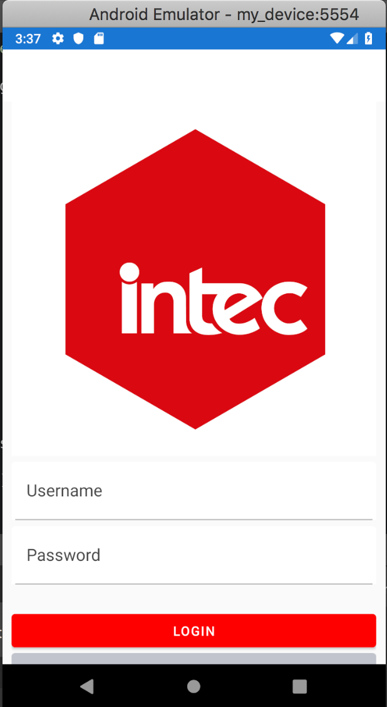
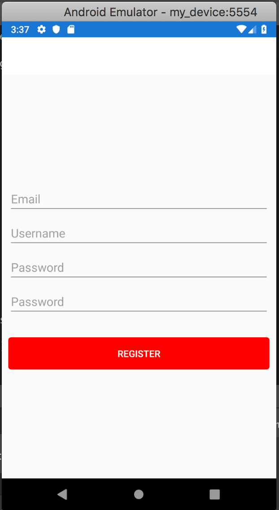
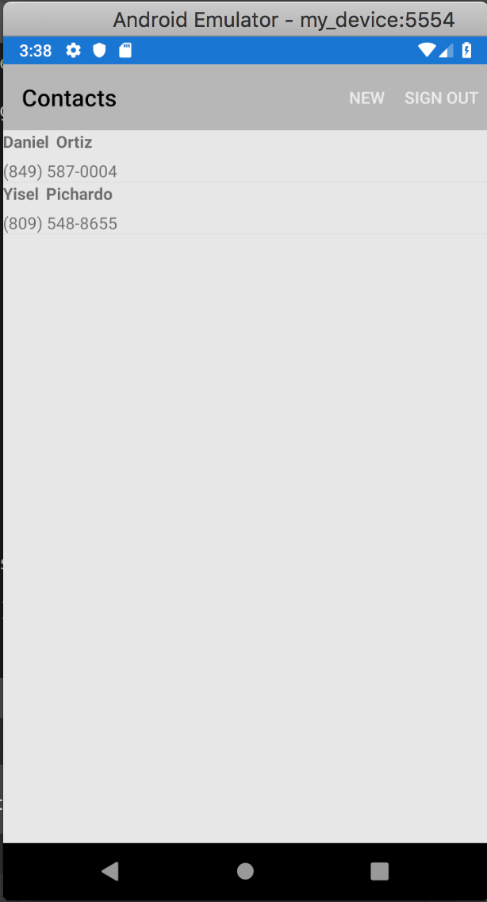
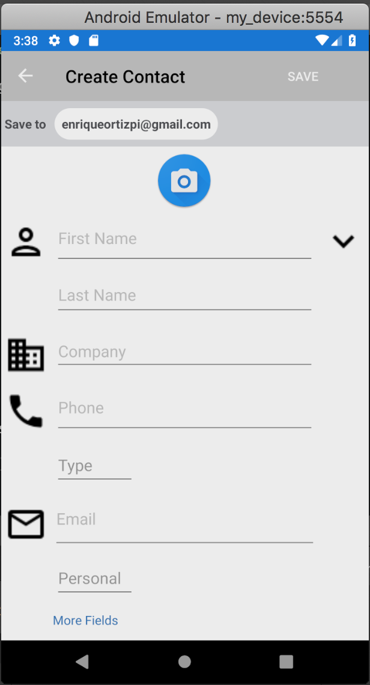
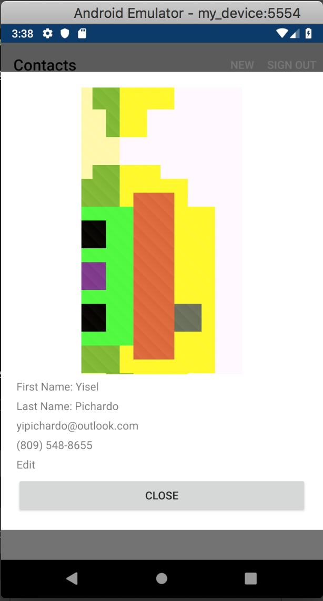

# xamingWithXamgirl
Repo for the Mobile App Development class at INTEC with Xamgirl!

## Homework 3 With Sushi Challenge: Contacts Dashboard

This week's homework was really cool and made me read a lot about Xamarin in general. We had to make a contacts dashboard with a complete CRUD. I went all the way for the extra points and the sushi challenge, and it surely gave me a challenge. Here's a list of things I used.

- SQLite along with the SQLite-pcl-net lib, [following this great article by Leomaris Reyes](https://askxammy.com/getting-started-with-local-databases-in-xamarin-forms/)
- Converters, [implemented with this article written by our teacher :P](https://xamgirl.com/understanding-converters-in-xamarin-forms/)
- Mask Behavior for phone numbers, [again with an article written by Leomaris Reyes](https://askxammy.com/applying-mask-in-xamarin-forms/)
- Extension Methods: [see here](https://www.campusmvp.es/recursos/post/Metodos-de-Extension-en-C.aspx)
- Messaging Center: [see here](https://www.youtube.com/watch?v=jEDxxtmfVZg)
- [James Montemagno's Media Plugin](https://github.com/jamesmontemagno/MediaPlugin)
- [Rg.Plugins.Popup for the contacts info](https://github.com/rotorgames/Rg.Plugins.Popup)
- Xamarin Forms Visual Material for theming
- Styles in Resources
- Fody for PropertyChanged
- [And, how Pujols would say, ce finito.](https://www.youtube.com/watch?v=dQw4w9WgXcQ)

## Homework 3 screenshots

     

     

     

     

